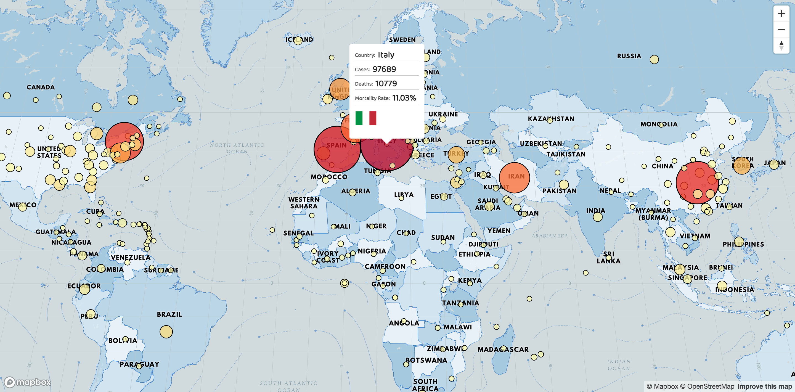

<h1 align="center">Welcome to mapbox-covid19 👋</h1>

[](https://app.netlify.com/sites/mapbox-covid19/deploys)

> COVID Map using Mapbox and React

- ✨ [Demo](https://mapbox-covid19.netlify.com/)
- 📝 [Dev.to tutorial](https://dev.to/alemesa/how-to-create-a-covid-19-map-with-mapbox-and-react-3jgf)
- 🖥️ [Markdown tutorial](./TUTORIAL.md)

## Usage

```sh
npm install && npm start
```

## Demo

Final result



## Tech

- [React](https://create-react-app.dev/)
- [Mapbox](https://www.mapbox.com/)
- [COVID19 API](https://docs.corona.lmao-xd.wtf/version-2)
- [Country Flags API](https://www.countryflags.io)

## Author

👤 **Alejandro Mesa**

- Website: https://alemesa.com
- Twitter: [@alelikesramen](https://twitter.com/alelikesramen)
- Github: [@alemesa](https://github.com/alemesa)

## Contributors

👤 **Insert Name** - [@github-name](https://github.com/username)

## How to contribute

No limitations, feel free to make a PR about anything

Tutorial is here [too](./TUTORIAL.md)

Thanks 🙏

## Show your support

Give a ⭐️ if this project helped you!

---

_This README was generated with ❤️ by [readme-md-generator](https://github.com/kefranabg/readme-md-generator)_
